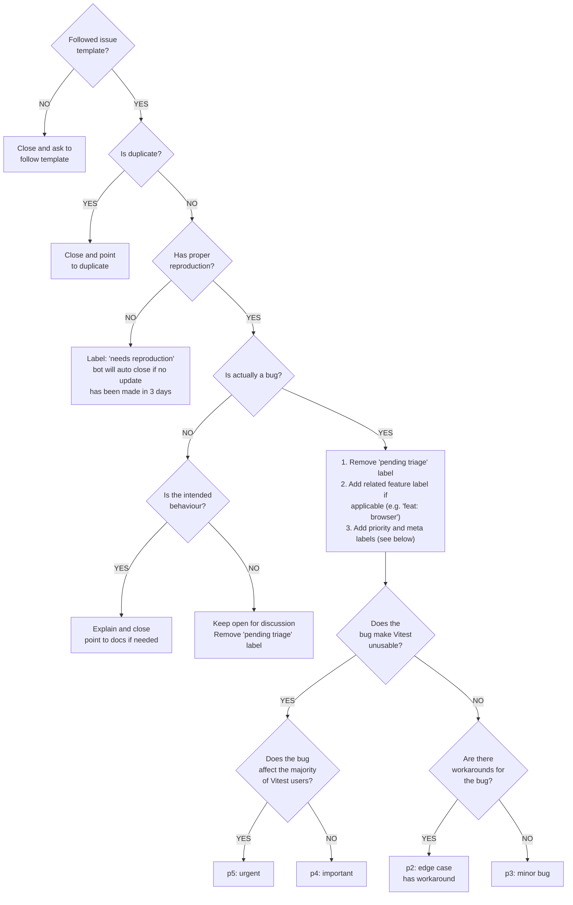
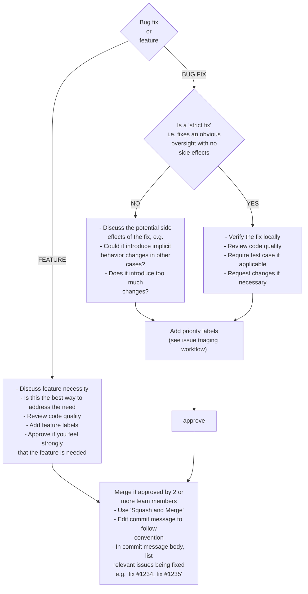

# Vitest Contributing 가이드

안녕하세요! Vitest에 기여하는 데 관심을 가져주셔서 정말 감사합니다. 번역 기여에 제출하기 전에 잠시 시간을 내어 다음 가이드를 자세히 읽어보시기 바랍니다.

## Repo Setup

Vitest 저장소는 pnpm 작업 공간을 사용하는 단일 저장소입니다. 종속성을 설치하고 연결하는 데 사용되는 패키지 관리자는 [pnpm](https://pnpm.io/)이어야 합니다.

다양한 패키지 관리자를 사용하여 저장소 간에 전환하는 데 도움이 되도록 [ni](https://github.com/antfu/ni)를 설치하는 것이 좋습니다. `ni`는 npm 스크립트를 더 쉽게 실행할 수 있는 편리한 `nr` 명령도 제공합니다.

- `ni`는 `pnpm install`과 동일합니다.
- `nr 테스트`는 `pnpm 실행 테스트`와 동일합니다.

`vitest` 패키지를 개발과 테스트하려면 다음과 같습니다.

1. `vitest`의 루트 폴더에서 `pnpm install`을 실행하세요.

2. watch 모드에서 소스를 빌드하려면 `pnpm run dev`를 실행하세요.

3. 실행하세요.
   - 테스트를 실행하는 `pnpm run test`
   - 모든 테스트를 실행하려면 `pnpm run test:all`

> 💡 VS Code를 사용하는 경우 `⇧ ⌘ B` 또는 `Ctrl + Shift + B`를 눌러 필요한 모든 개발 작업을 시작할 수 있습니다.

## 디버깅

### VS Code

중단점을 사용하고 코드 실행을 탐색하려면 vscode의 ["실행 및 디버그"](https://code.visualstudio.com/docs/editor/debugging) 기능을 사용할 수 있습니다.

1. 코드 실행을 중지하려는 곳에 'debugger' 문을 추가하세요.

2. 편집기의 활동 표시줄에서 "실행 및 디버그" 아이콘을 클릭하세요.

3. "Javascript debugger terminal" 버튼을 클릭하세요.

4. 터미널이 열리고 테스트 명령인 `pnpm run test`를 입력합니다.

5. 실행이 중지되고 [디버그 도구 모음](https://code.visualstudio.com/docs/editor/debugging#_debug-actions)을 사용하여 계속 진행하고, 한 단계 더 진행하고, 프로세스를 다시 시작합니다.

## 외부 패키지에 대한 Vitest 테스트

You may wish to test your locally-modified copy of Vitest against another package that is using it. For pnpm, after building Vitest, you can use [`pnpm.overrides`](https://pnpm.io/package_json#pnpmoverrides). Please note that `pnpm.overrides` must be specified in the root `package.json` and you must first list the package as a dependency in the root `package.json`:

```json
{
  "dependencies": {
    "vitest": "*"
  },
  "pnpm": {
    "overrides": {
      "vitest": "link:../path/to/vitest/packages/vitest"
    }
  }
}
```

그리고 `pnpm install`을 다시 실행하여 패키지를 연결하세요.

`package.json` 옆에 다음 줄을 사용하여 `.npmrc` 파일을 추가합니다.

```sh
VITE_NODE_DEPS_MODULE_DIRECTORIES=/node_modules/,/packages/
```

## Pull Request 가이드라인

- 기본 브랜치에서 토픽 브랜치를 체크아웃하세요. `main`을 선택하고 해당 브랜치에 대해 다시 병합합니다.

- 새로운 기능을 추가하는 경우

  - 함께 제공되는 테스트 케이스를 추가합니다.
  - 이 기능을 추가해야 하는 근거 있는 이유를 제공해주세요. issue 먼저 열고 작업하기 전에 approval 받아야 합니다.

- 버그를 수정하는 경우

  - 특별한 문제를 해결하는 경우 더 나은 릴리스 로그를 위해 PR 제목에 `(fix #xxxx[,#xxxx])`(#xxxx is the issue id)를 추가하세요. `fix: update entities encoding/decoding (fix #3899)`.
  - PR에 버그에 대한 자세한 설명을 제공하세요. Live demo 선호합니다.
  - 해당되는 경우 적절한 테스트 범위를 추가하십시오.

- PR 작업을 하면서 여러 개의 작은 커밋을 갖는 것은 괜찮습니다. GitHub 병합하기 전에 자동으로 커밋을 스쿼시할 수 있습니다.

- 테스트를 통과하는지 확인하세요!

- 커밋 메시지는 [커밋 메시지 규칙](./.github/commit-convention.md)을 따라야 변경 로그가 자동으로 생성될 수 있습니다.

- 프로젝트 지침에 따라 파일 형식을 지정하려면 `pnpm run lint:fix`를 사용하세요.

## Maintenance 가이드라인

> 다음 섹션은 주로 커밋 액세스 권한이 있는 관리자를 위한 것이지만 코드베이스에 적지 않은 기여를 하려는 경우 진행하는 것이 도움이 됩니다.

### 문제 분류 작업흐름



### Pull Request 리뷰 작업흐름



## 종속성에 대한 참고 사항

Vitest는 경량화를 목표로 하며 여기에는 npm 종속성 수와 크기를 인식하는 것이 포함됩니다.

### 종속성을 추가하기 전에 생각해봅니다.

런타임에 필요한 경우에도 대부분의 deps는 `devDependency`에 추가되어야 합니다. 일부 예외는 다음과 같습니다.

- 패키지를 입력하세요. 예: `@types/*`.
- 바이너리 파일로 인해 제대로 번들링할 수 없는 Dep입니다.
- 내부에서만 사용되는 자체 유형과 Vitest가 제공하는 의존성 유형을 제공하는 Deps는 vitest의 자체 공개 유형에서 사용됩니다.

Avoid deps that has large transitive dependencies that results in bloated size compared to the functionality it provides.

필요한 라이브러리가 요구사항 규격 사이즈에 맞지 않는다면, 포크로 작업하는 동안 포크의 크기를 줄이려고 시도할 수 있습니다.
변경사항 업스트림 예를 들어 [tinypool](https://github.com/tinylibs/tinypool) 참조

### 또 다른 옵션을 추가하기 전에 생각해 볼 수 있습니다.

이미 많은 구성 옵션이 있으므로 다른 옵션을 추가하여 문제를 해결하는 것을 피해야 합니다. 옵션을 추가하기 전에 다음 사항을 생각해 봅니다.

- 문제가 실제로 해결할 가치가 있는지 여부
- 스마트한 기본값으로 문제를 해결할 수 있는지 여부
- 기존 옵션을 사용하여 문제를 해결할 수 있는지 여부
- 플러그인을 대신 사용하여 문제를 해결할 수 있는지 여부
